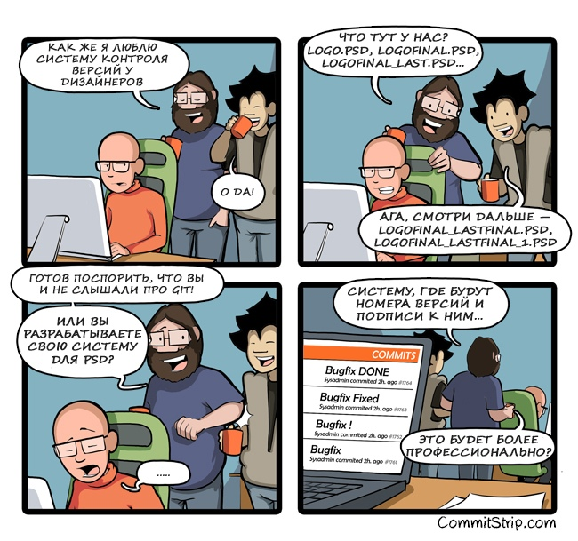

# Гуреев Андрей

### Основная информация и образование:
Адрес проживания город Ижевск. Высшее образование Ижевского Государственного Университета.

### Дополнительная информация:
Вредных привычек не имею. Коммуникабелен, ответственный, добросовестный, дисциплинированный, исполнителен, активен, инициативен, креативен, нестандартный подход к решению задач, внимателен к деталям, настойчив в достижении поставленных целей. Считаю, что главное, относится к своей работе творчески и постоянно профессионально развиваться. Легкообучаем, желание работать.

### Хобби:
* Настольный теннис
* Бильярд
* Волейбол
* Баскетбол
* Литература

### Навыки:
 * Разработка личных ПК программ
 * Работа в КОМПАС-3D
 * 3D моделирование

 